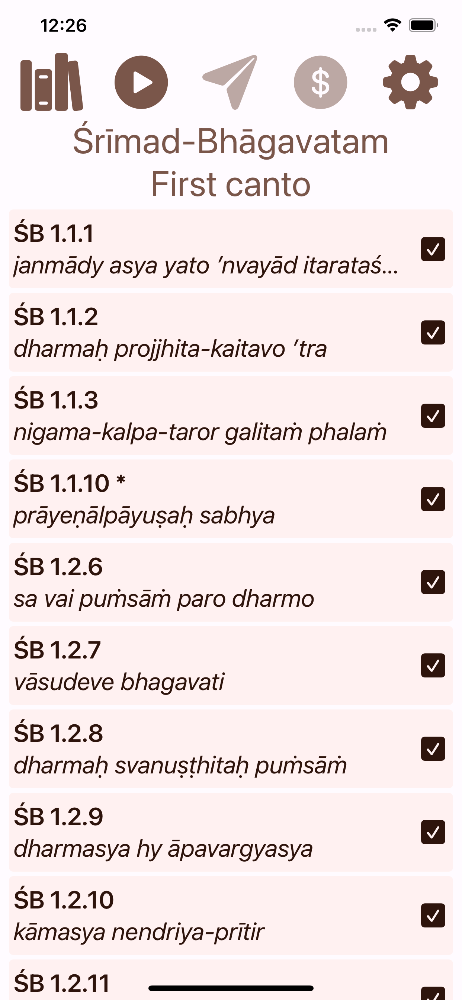
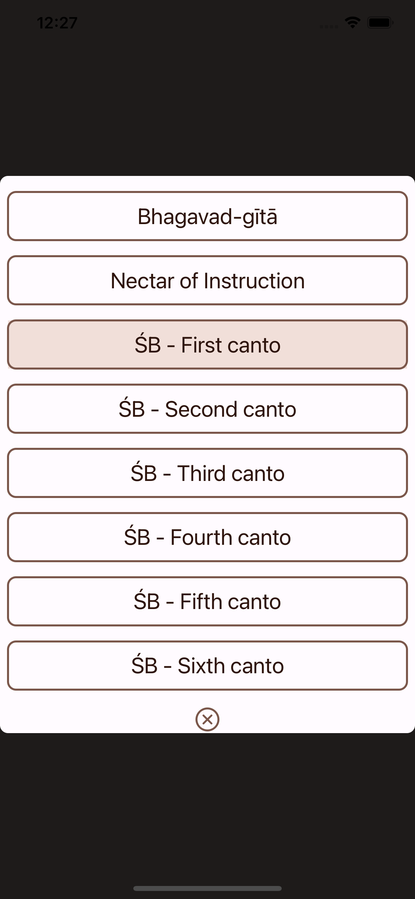
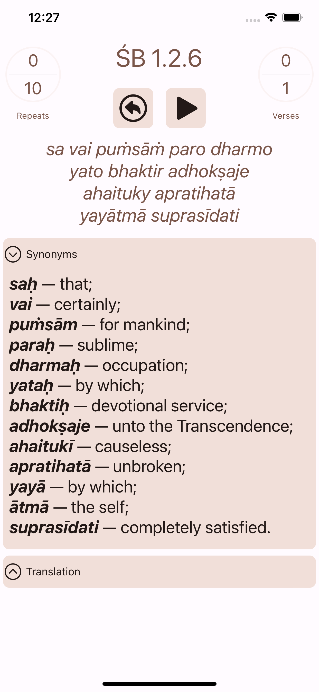
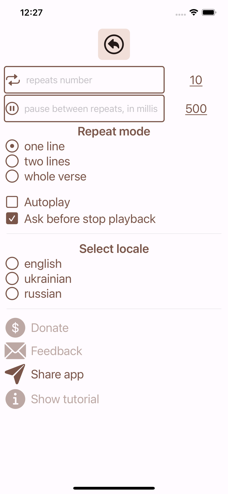

# Memorize Shloka

## [Google play](https://play.google.com/store/apps/details?id=com.a_blekot.memorize_shloka)

## [App Store](https://apps.apple.com/us/app/memorize-shlokas/id6443863948)

## [Github](https://github.com/a-blekot/memorize_shloka)

If I can be of assistance, please do not hesitate to contact me!
## aleksey.blekot@gmail.com

# Android and IOs versions implemented

This app uses an ancient approach to memorizing Sanskrit verses (shlokas) from the Vedic scriptures: Srimad-Bhagavatam, Bhagavad-Gita, and others.

* Select scripture: Srimad-Bhagavatam, Bhagavad-gita, Nectar of Instructions, …
* Playlist of verses or a single verse
* Choose the number of repeats
* Choose repeat-type - single line, two lines or whole verse
* Pause playback
* Sanskrit transliteration, synonyms, and translation
* Day/Night theme
* English, Ukrainian and Russian localizations

# Andriod additional features:
* inapp-update, inapp-review, inapp-purchase

# Tech stack

- [Kotlin Mobile Multiplatform](https://kotlinlang.org/lp/mobile/)
- [MVI-Kotlin](https://arkivanov.github.io/MVIKotlin/)
- [Decompose](https://arkivanov.github.io/Decompose/)
- [KMM Settings](https://github.com/russhwolf/multiplatform-settings)
- [ExoPlayer](https://exoplayer.dev/) (for now only Android app has a player functionality)
- [JetpackCompose](https://developer.android.com/jetpack/compose) (Android)
- [SwiftUI](https://developer.apple.com/xcode/swiftui/) (IOs)

